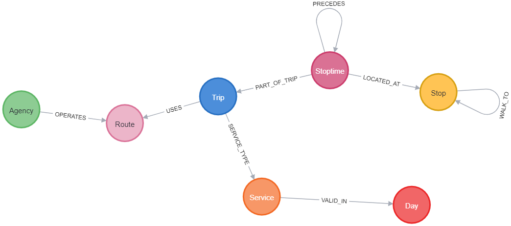

# PublicTransportGraph
Questo progetto si propone di rappresentare la rete del Trasporto pubblico Modenese in un Database a grafo partendo da un file GTFS. Prima di poter caricare i dati sono necessari alcuni passaggi per il corretto funzionamento dello script dbSetup.py che si occupa proprio di questo
## Prerequisiti
Per caricare il feed GTFS si utilizza Neo4j, è necessario dunque utilizzare Neo4j Desktop, avviare un DBMS e importare al suo interno il feed GTFS. Per caricare il feed è necessario prima eseguire il file reshape.py (modificando il path per il feed GTFS come necessario) il quale genererà un nuovo file *new_calendar_dates.txt* utilizzato per caricare correttamente le date all'interno di Neo4j. Messi a disposizione i file al DBMS si può eseguire il file dbSetup.py facendo attenzione a username e password usati per l'accesso al Database.

## Caricamento dati in un Database
I dati vengono caricati in un db tramite l'esecuzione del file dbSetup.py che esegue le seguenti operazioni:

1. Esegue la connessione ad un'istanza di Db su Neo4j
2. Crea i Constraint e gli indici utili per la realizzazione della struttura a grafo
3. Aggiunge i nodi e crea le relazioni tra questi partendo dai file ricavati dal feed GTFS

Eseguito il file la struttura finale del grafo sarà la seguente: 
